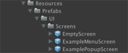
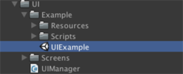

# Unity UI Manager

## What is this and why should I use it?
The UI Manager is a stack-based UI controller class. It is designed to make pushing and popping screens in Unity simple and intuitive. No need to have a hundred different UI prefabs sitting in a scene being toggled on and off, the UI Manager can instantiate and manage screens on-demand. It is a cleaner, more streamlined, and easier to maintain approach to UI development than what Unity provides out of the box.

## How does it work?
The core functionality of UI Manager is made up of only two simple classes: `UIManager` and `Screen`.

### UIManager
`UIManager` is responsible for instantiating and maintaining the screen stack. When you want to push or pop a screen to the stack, you interact with `UIManager`.  

`UIManager` has a few prerequisites that should be understood when using it:

> ### Prerequisites
> >
> > 1. **Screen Prefab Folder**
> > The UIManager looks for screen prefabs by name inside a specific folder that you specify in the 
> > constructor. This folder must reside within a folder called 'Resources' in the Unity project.
> > 
> >       
> >     *Example of a screen prefab directory structure.*
> > 
> > 
> > 2. **UI Root Canvas**  
> > The UI Manager organizes all screens underneath a root Canvas object. You must provide the UI
> > Manager what Canvas object you want to use for this purpose.
> > 
> > 3. ***Optional* UI Camera**
> > If you want to render your UI with a seperate Unity Camera you can pass it to the UIManager 
> > inside the constructor. By default, Unity does not use a seperate Camera to render UI elements,
> > so this isn't necessary unless you need it.
> 
> ### Core Methods
> 
> #### QueuePush
> Queue a screen up to be pushed to the stack.
>
> > *Parameters*  
> >
> > `Screen.Id id`  
> > The id that this screen will be known by. The id is used to to identify the screen everywhere in 
> > the UIManager.
> >
> > `Screen.Data data` **Optional**  
> > The data container that will be passed to the instance of the screen when it is pushed onto the 
> > stack.
> >
> > `string prefabName`  
> > The name of the prefab that will be instantiated.
> > 
> > `PushedDelegate callback` **Optional**  
> > The callback that will be called when the screen has been pushed onto the stack.
>
> #### QueuePop
> Queue the top screen on the stack to be popped.
>
> > *Parameters*  
> >
> > `PoppedDelegate callback` **Optional**  
> > The callback that will be called when the screen has been popped from the stack.
>
> #### QueuePopTo
> Queue the specified screen to be popped from the stack. This will pop all screens on top of it as well, keeping inline with the behaviour of a true stack.
> 
> > *Parameters*
> > 
> > `Screen.Id id`  
> > The id of the screen that you want to pop up to. If you want to include this screen in the pop 
> > see the 'include' field.
> >
> > `bool include`  
> > If false, will pop up to but not including the specified screen. If true, will also pop the specified screen.
> >
> > `PoppedDelegate callback` **Optional**  
> > The callback that will be called when the screen has been popped from the stack.
>
> #### GetScreen
> Retrieve a reference to the specified screen from the stack.
>
> > *Parameters*
> > 
> > `Screen.Id id`  
> > The id that this screen will be known by. The id is used to to identify the screen everywhere in the UIManager.

### Screen
`Screen` is the base class for all screens that `UIManager` interacts with. `Screen` is a `MonoBehaviour` that defines some methods that are called by `UIManager`. Your `Screen` script should always be attached at the top most `GameObject` in your screen prefab. Be sure to understand what these methods are as you will need to implement them in your screens!

> ### Screen.Data class
> The `Screen.Data` class is a data container object. Internally it is backed by a `Dictionary` 
> collection object. Use the `Screen.Data` class in order to pass user-defined data sets to the 
> screens. Not all screens need a `Screen.Data` object, therefore in some cases passing `null` will be 
> fine. Some screens may require some fields from from the `Screen.Data` container, this is really up 
> to you as the developer to decide how to use in your project.
>
> ### Core Fields
> > #### keepCached
> > `UIManager` gives you the option to disable a screen object instead of destroying it completely when 
> > the screen is popped from the stack. This will keep the screen object cached in memory and when it is 
> > pushed to the stack again will reuse the cached object instead of instancing a new one from the prefab.
>
> ### Core Methods
> > #### OnSetup
> > `OnSetup` is called after instantiating a screen prefab. It is only called once for the lifecycle of 
> > the `Screen`.
> > #### OnPush
> > Called by the `UIManager` when the `Screen` is being pushed to the stack. 
> > 
> > ```
> > IMPORTANT: Be sure to call PushPopFinished when your screen is done pushing. Delaying the
> > PushPopFinished call allows the screen to delay execution of the UIManager screen queue.
> > ```
> > 
> > > *Parameters*
> > > 
> > > `Screen.Data data`  
> > > The user-defined data container for this screen. Useful for sending custom data sets to the screen 
> > > that you can use to setup information before the screen is visible and on the stack.
> > 
> > #### OnPop
> > Called by the `UIManager` when this `Screen` is being popped from the screen stack.
> >
> > ```
> > IMPORTANT: Be sure to call PushPopFinished when your screen is done pushing. Delaying the 
> > PushPopFinished call allows the screen to delay execution of the UIManager screen queue.
> > ```
> > 
> > #### OnFocus
> > Called by the `UIManager` when this `Screen` becomes the top most screen in the stack.
> > 
> > #### OnFocusLost
> > Called by the `UIManager` when this `Screen` is no longer the top most screen in the stack.

## Example Scene / Scripts

Included with the core `UIManager` classes is an example scene with example scripts.
Open the scene *UIExample* inside the *Example* folder.

Press play in the editor and play with the example to get a grasp of how it is organized.
When you're ready to look at the setup process and various screens in detail you should start by looking at the script `UIManager/Examples/Scripts/GameManager.cs`

This script is the entry point for the example and is where the `UIManager` is setup and the first screen is pushed onto the stack.

  
*The UIExample scene is a good starting point to learning how to use the UIManager.*


## Support Contact
**Original Author / Maintained By**  
Ryan Cook - <ryancook423@gmail.com>